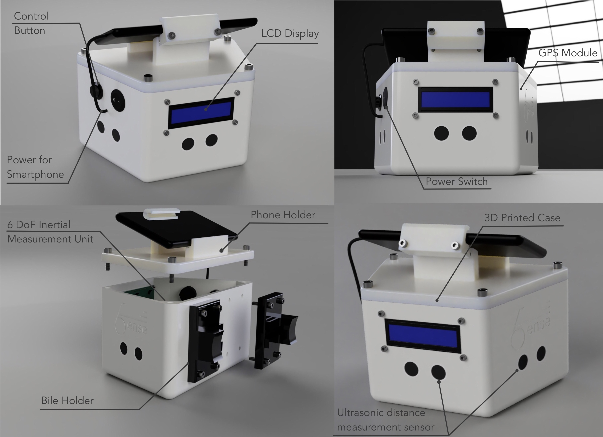
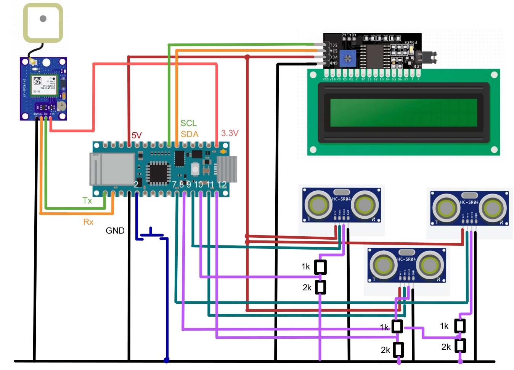

# 6ense
## Prototype:

## Board:

## Main Structure in Arduino Code:

### Interfaces:
- `I_Component`: every object that should have a setup and be called in the main loop inherits from this interface
- `I_BTSender` : every object that should send data through bluetooth inherits from this interface
### Interation:
- `button` object allows you to get a signal from the button.
    - `button.wasPressedOnce()` returns True if shortly pressed
    - `button.wasPressedOnceLong()` returns True if pressed longer than *duration* seconds
- `display` object allows you to print in the LCD-Screen
    - `display.setCursor(col, lin)`
    - `display.print("Hello")` prints at the cursor
- `scorer` object computes the scores using the sensor values.
- `sensorPrinter` object uses the display to print the sensor values.
### Sensors:
- `sonar` object allows you to get values from one sonar (not used)
- `sonarCollection` object allows you to get values from multiple sonar objects. It contains a vector of sonars
- `imu` object interacts with the IMU through the I2C bus
- `gps` object allows you to get the values of the current position.

### Communication:
- `bluetooth` object gathers the data from the bluetooth sender objects and deals with the bluetooth connection.

### Timing:
- `Timer`: timer objects allow to measure the time beetween two times (tic() and toc())
- `Coordinator`: coordinator allows components to do something in the loop if "their time has come"

## Branching:
- `main`: main code for the product. Never push on it.
- `develop`: development branch with changes coming.
- `feature branches` : short living branches to implement new features. Merge them on `develop` with --no-ff to prevent fast forwarting if you are sure that the code works.

## Main Structure of App Code:

### Model:
- `Model`: main class for adding and retrieving safety data
- `SafetyScore` : model for safety score
- `SafetyIncident` : model for safety incident
### Managers:
- `LocationManager` : retrieves current user location
- `BluetoothManager` : creates conenction with 6ense device. Reads data every second and stores them in model
### Views:
- `MainView` : fullscreen view containing all views
#### Components
- `MapRouteDrawer` : colorizes the route according to safety score increment/decrement
- `ScoreView` : view of all safety scores
- `MapView` : view of integrated Apple Map
- `RideButtonView` : start and stop button for recording ride
- `IncidentCardView` : popup view of safety incidents
